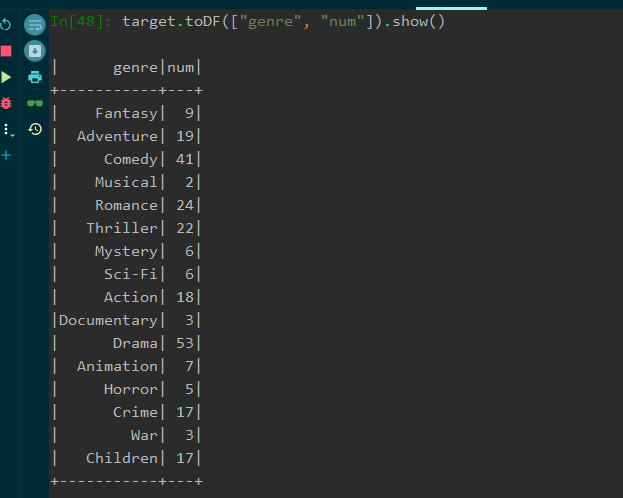
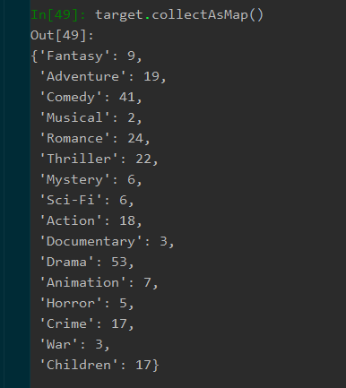

[TOC]


## 使用`pyspark`操作数据库

### 1.`sqlite`篇

```python
# -*- coding: utf-8 -*-
# @Author: xiaodong
# @Date  : 2020/4/4

from pyspark.sql import SparkSession


if __name__ == '__main__':
    spark = SparkSession.builder.appName("sqlite").getOrCreate()

    # 注意，这里的sqlite的db路径需要写绝对路径。
    url = "jdbc:sqlite:D:/work/workspace/python_executor_db/data/dbs/movies.db?rewriteBatchedStatements=true"
    properties = {"driver": "org.sqlite.JDBC"}
    links_frame = spark.read.jdbc(url,
                                  "(select * from links)a",
                                  properties=properties)
    movies_frame = spark.read.jdbc(url,
                                   "(select * from movies)b",
                                   properties=properties)

    # 如果你擅长用sql,你可以这么做
    links_frame.registerTempTable("links")
    movies_frame.registerTempTable("movies")

    r = spark.sql("""
        select
            a.*, b.*
        from 
            links a,
            movies b
        where a.movieId = b.movieId
    """)
	r.show()
    
    # 以下两种方式，由于当存在相同列名时不好取列，因此需要特殊处理下
    r = links_frame.join(movies_frame, links_frame.movieId == movies_frame.movieId)
    r = links_frame.join(movies_frame, on="movieId").select(links_frame.moviesId.alias("a_movieId"),
                                                            movies_frame.moviesId.alias("b_movieId"),
                                                            "imdbId",
                                                            "tmdbId",
                                                            "title",
                                                            "genres"
                                                            )

    # 对genres列做统计, 统计各genre元素出现个数
    target = (
                r.select("genres")
                 .rdd
                 .map(lambda obj: obj.genres.split("|"))
                 .flatMap(lambda obj: obj)
                 .map(lambda obj: (obj, 1))
                 .reduceByKey(lambda x, y: x+y)
             )
    print(target.collectAsMap())
    r = target.toDF(["genre", "num"])
    r.cache().show()
    
    # 将数据写入到别的数据库（如：oracle，mysql，greenplum)
    # 不过，这么写入sqlite时有点问题，如果谁有spark写入sqlite的途径，可以交流下~
    # (
    #     r.write.format("jdbc") # .format("greenplum")
    #            .options(**your-options-dict)  # {"url": "your-jdbc-url", "dbtable": "your-table", "driver": "your-driver"}
    #            .mode("overwrite")
    #             .save()
    # )


```



